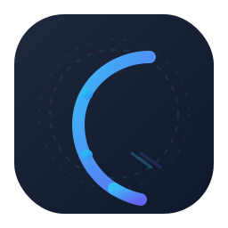

> 🌐 English Version：[🇬🇧 README_EN](./README_EN.md)
<div align="center">
  
  <h1>CodeCraft 🛠️</h1>
  <p><strong>DeepSeek 驱动的 AI 编程 Agent · 终端级代码助手 · 自然语言开发工具</strong></p>
  <p>
    AI Coding Agent | AI Pair Programming | Autonomous Coding Assistant | LLM-Powered DevTool<br>
    基于 DeepSeek 大语言模型的智能体编程助手——自然语言对话，自动读写文件、搜索代码、执行命令、管理 Git，复杂任务自动拆解并行执行
  </p>

  <p>
    
    
    
    
    
    
    
    
  </p>
</div>

---

## 🏷️ 关键词 / Topics

`ai-coding-assistant` `coding-agent` `ai-agent` `deepseek` `llm` `large-language-model` `vibe-coding` `developer-tools` `cli-tool` `terminal` `ai-pair-programming` `autonomous-agents` `multi-agent` `task-decomposition` `code-generation` `agentic-ai` `open-source` `ai-assisted-development` `coding-assistant` `git-automation` `ai-software-engineer` `agent-framework` `self-hosted` `natural-language-programming` `ai-code-editor`

> 💡 **搜这些词都能找到 CodeCraft！** 以上是 GitHub 上同类 AI 编程助手（Cline / Aider / OpenCode / Codex / Cursor 等）用户最常用的搜索关键词，已全部覆盖。

---

## 📖 项目简介

**CodeCraft** 是一个基于 **DeepSeek 大语言模型（Large Language Model）** 构建的 **AI 编程 Agent（AI Coding Agent / AI Pair Programming Tool）**，以桌面应用 + 终端命令行的形态，将自然语言对话转化为生产力级的自动化编程操作。

与普通的 AI ChatBot 聊天助手不同，CodeCraft 是一个真正具备**完整工具调用能力（Tool Use / Function Calling）** 的 **Autonomous Coding Agent（自主编程智能体）**——它能读取项目文件、搜索代码库、执行 Shell 命令、操作 Git 版本控制，甚至自动创建子 Agent 并行处理复杂开发任务，像一位 **AI 软件工程师（AI Software Engineer）** 一样独立完成工作。

### 🆚 与同类项目对比

| 特性 | CodeCraft | Cline | Aider | OpenCode | Codex CLI |
|------|-----------|-------|-------|----------|-----------|
| 底层模型 | **DeepSeek** | Claude/GPT | 多模型 | Claude/GPT | OpenAI |
| 形态 | **桌面应用 + CLI** | VS Code 插件 | 终端 CLI | 终端 TUI | 终端 CLI |
| 多 Agent 并行 | ✅ 最多20并发 | ❌ | ❌ | ❌ | ✅ |
| 快照回滚 | ✅ 内置 | ❌ | ❌ | ❌ | ❌ |
| 技能系统 | ✅ 贝叶斯置信度 | ❌ | ❌ | ❌ | ❌ |
| P2P 远程协作 | ✅ Netty+TLS | ❌ | ❌ | ❌ | ❌ |
| 开箱即用 | ✅ 内置JRE | ❌ 需配置 | ❌ 需配置 | ❌ 需配置 | ❌ 需配置 |

---

## ✨ 核心功能

### 🧠 多 Agent 并行协作（Multi-Agent System）
可创建不同角色的 AI Agent（Coding Agent、Code Reviewer、Software Architect 等），每个 Agent 独立配置系统提示词（System Prompt）、工具集和模型参数。主 Agent 执行复杂任务时，自动进行 **Task Decomposition（任务拆解）**，召唤多个子 Agent 后台并行执行，最多 20 个并发协作——典型的多 Agent 框架（Multi-Agent Framework）架构。

### 🛡️ 三层安全防护（Human-in-the-Loop）
工具执行采用渐进式安全策略：Manual 模式下数据操作和路径敏感操作弹窗授权，Auto 模式下高危工具（file_writer action=delete / execute_sql 等）仍需人工确认。支持"本轮对话全部同意"一键放行，在 Autonomous Agent 自动化和 Human-in-the-Loop 人工管控之间取得最佳平衡。

### 📸 代码快照回滚（Snapshot / Undo System）
AI 修改文件前自动创建快照备份，支持按消息、按文件、按会话三种粒度回滚，500MB 配额自动清理。类似 Aider 的 undo 机制，但更细粒度。

### 🧩 智能技能系统（Agent Skills / Plugin System）
将常用操作流程封装为可复用技能（名称 + 触发词 + 执行步骤），AI 通过 BM25 + 触发词双路匹配自动调用，贝叶斯置信度动态调整确保越用越精准。技能信息采用「动态注入」不占上下文窗口，长对话开销恒定——类似 Claude Code 的 custom commands / Codex 的 skills 机制。

### ⏰ 定时任务（Scheduled / Cron Job）
支持一次性任务和 Cron 周期任务，可绑定指定 Agent 自动执行，每次执行生成独立会话追溯。实现 Agentic Workflow（智能工作流）自动化。

### 🖥️ 内置代码编辑器（Built-in Code Editor）
基于 highlight.js 的自研编辑器，支持 30+ 语言语法高亮、行号、暗色主题、光标定位、dirty 标记和快捷键保存。

### 🎨 智能 Markdown 渲染
支持 KaTeX 数学公式、命令终端卡片、文件清单卡片、彩色提示容器、XSS 安全防护。

### 👥 用户管理与权限（Multi-User / RBAC）
完整的账户体系：注册登录、Token 鉴权（JWT）、角色权限控制（RBAC）、菜单可见性管理、初始管理员自动创建。

### 🧰 19 个工具生态（Tool Use / Function Calling）
文件操作、命令执行、网络请求、数据库查询、Git 版本控制、Agent 协作、技能管理等 7 大类 19 个工具全部对 AI 开放——覆盖 Software Engineering 日常开发全流程。

### 🧠 智能上下文压缩（Context Window Management）
三级渐进式压缩策略（预警→压缩→丢弃），LLM 摘要 + 保护带机制 + 异步预压缩，确保超长对话不超 Token 限制、不崩溃。

### 🔗 P2P 远程协作（Peer-to-Peer Remote）
基于 Netty + TLS 的点对点安全通道，可将 Agent 授权给远程伙伴调用。支持二维码配对、IPv6 直连、端到端加密、图片/文件传输。

### 💾 开箱即用（Zero Config / Portable）
Electron 桌面应用，内置 JRE + Node.js + H2 嵌入式数据库，下载安装即用，零配置。支持 Windows / macOS / Linux 三平台。

---

## 🏗️ 技术栈

| 层级 | 技术 | 版本 |
|------|------|------|
| **AI 大模型** | **DeepSeek**（兼容 OpenAI API 格式） | - |
| **后端** | Java + Spring Boot | 17+ / 3.4 |
| **前端** | Vue 3 + TypeScript + Vite | 3.5 / 5.x / 6.x |
| **桌面壳** | Electron | 33 |
| **数据库** | H2 (嵌入式) + Caffeine (缓存) | 2.2+ / 3.1+ |
| **构建** | Maven + npm | 3.8+ / 10+ |

---

## 🚀 快速开始

### 💾 下载安装（普通用户）

不想搭建开发环境？直接下载已打包好的安装包：

- 前往 **[GitHub Releases 页面](https://github.com/zb614433612/CodeCraft/releases)** 
- Windows 用户下载 `CodeCraft-Setup-x.x.x.exe`
- macOS 用户下载 `CodeCraft-x.x.x.dmg`
- Linux 用户下载 `CodeCraft-x.x.x.AppImage`
- 双击安装即可使用，**无需安装 Java**（JRE 已内置在安装包中）

> 安装后启动，后端服务自动运行（等待约 10~30 秒），然后自动打开主界面。
> 首次使用请先到「配置」页面设置你的 **DeepSeek API Key**。

---

### 环境要求（开发者）

| 依赖 | 版本 | 说明 |
|------|------|------|
| Java | 17+ (JDK) | 构建时需要 `JAVA_HOME`，运行时无需安装 |
| Maven | 3.8+ | 后端构建 |
| Node.js | 20+ | 前端和 Electron 构建 |
| npm | 10+ | 随 Node.js 安装 |

### 开发模式运行

```bash
# 1️⃣ 构建后端（自动编译前端）
mvn clean package -DskipTests

# 2️⃣ 启动后端服务
mvn spring-boot:run

# 3️⃣ 访问 http://localhost:8084
```

### 单独启动前端（热更新）

```bash
cd frontend
npm install
npm run dev
```

### 启动 Electron 桌面应用

```bash
cd electron
npm install
npm start
```

> 详细构建和运行指南请参见 [BUILD_AND_RUN.md](BUILD_AND_RUN.md)

---

## 📂 项目结构

```
codecraft/
├── src/                          # Java 后端源码（Spring Boot）
│   ├── main/java/                # 主代码
│   │   └── com/example/agentdeepseek/
│   │       ├── common/           # 通用枚举、响应封装
│   │       ├── config/           # 配置类
│   │       ├── controller/       # REST API 控制器（含工具注册表 API）
│   │       ├── filter/           # 过滤器（Token 鉴权）
│   │       ├── mapper/           # MyBatis 数据访问层
│   │       ├── model/            # DTO、实体、VO
│   │       ├── scheduler/        # 定时任务
│   │       ├── service/          # 业务逻辑层
│   │       ├── tool/             # AI Agent 工具（19 个工具）
│   │       │   ├── impl/         # 工具实现
│   │       │   ├── permission/   # 工具权限控制
│   │       │   └── postedit/     # 工具后处理（格式化、检查）
│   │       └── util/             # 工具类
│   └── main/resources/           # 配置文件和静态资源
├── frontend/                     # Vue3 前端源码
│   ├── src/
│   │   ├── api/                  # 后端 API 调用（agent-config, chat, conversation, skill, tools 等）
│   │   ├── components/           # 组件（AgentSelector, SkillList, FileTree 等）
│   │   ├── views/                # 页面（CodeAssistantView, AgentConfigView, SkillManageView 等）
│   │   ├── store/                # 状态管理
│   │   └── utils/                # 工具函数
│   └── public/                   # 静态资源
├── electron/                     # Electron 桌面壳
│   ├── main.js                   # Electron 主进程
│   ├── package.json              # Electron 配置
│   └── start.sh / start.bat     # 启动脚本
├── pom.xml                       # Maven 构建配置
├── scripts/                      # 自动化脚本（版本同步 / 一键构建）
├── .github/workflows/            # GitHub Actions CI（自动发布）
├── BUILD_AND_RUN.md              # 构建与运行指南
├── CHANGELOG.md                   # 版本更新日志
├── .gitignore                    # Git 忽略规则
└── application-local.yml.example # 本地配置模板
```

---

## 📚 文档导航

想深入了解 CodeCraft 的架构和开发细节？查看 [docs/](docs/) 目录：

| 文档 | 适合谁 | 说明 |
|------|--------|------|
| [架构全景图](docs/ARCHITECTURE.md) | 新人 / AI 协作 | 5 分钟建立全局认知 |
| [工具系统](docs/TOOL_SYSTEM.md) | 开发者 | 如何新增一个 AI Tool |
| [核心引擎](docs/DEEPSEEK_SERVICE_IMPL.md) | 资深开发者 | Tool Loop 状态机 + 方法调用拓扑 |
| [P2P 协作](docs/P2P_SYSTEM.md) | 开发者 | 远程 Agent 调用全链路 |
| [快照系统](docs/SNAPSHOT_SYSTEM.md) | 开发者 | 代码备份与回滚机制 |
| [开发速查](docs/DEV_QUICKREF.md) | 日常开发 | 常用命令 / 端口 / 账号 |
| [发布清单](docs/RELEASE_CHECKLIST.md) | 维护者 | 打包发布 step-by-step |
| [常见问题](docs/FAQ.md) | 所有人 | 16 条已踩坑 FAQ |

---

## 🤝 贡献指南

欢迎贡献代码、报告 Bug 或提出新功能建议！请参见 [CONTRIBUTING.md](CONTRIBUTING.md)。

---

## 📄 开源许可

本项目基于 [MIT License](LICENSE) 开源。

---

## 🙏 致谢

- [DeepSeek](https://deepseek.com/) — 强大的大语言模型（LLM），驱动 CodeCraft 的核心智能
- [Spring Boot](https://spring.io/projects/spring-boot) — 后端框架
- [Vue.js](https://vuejs.org/) — 前端框架
- [Electron](https://www.electronjs.org/) — 跨平台桌面应用框架
